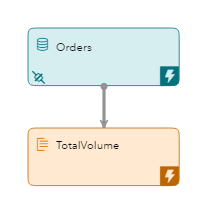

# Aggregating Stock Transactions Using ESP

    

In this repository, you'll see how to aggregate stock transactions using SAS Event Stream Processing (ESP) 6.1. 

**Model Description, Editing, Executing, and Subscribing**

  

**Editing with SAS ESP Studio**


## Overview

The Aggregating Stock Transactions model is a simple XML model included in the examples that are installed with SAS Event Stream Processing (ESP) 6.1. It includes a Source window with an Input Data Connector and an Aggregate window to perform aggregate functions on the stream.



The model reads stock transactions for a set of stock symbols. The input stream includes the following for each transaction:

*  Stock Symbol
*  Number of Shares
*  Price of the Stock

The model then aggregates the total number of shares traded for each symbol.
  
This repository includes the files required to execute the example and video demonstrations that include the following topics:
  
 *   Viewing and editing the model using a text editor
 *   Viewing and editing the model in SAS ESP Studio (optional)
 *   Executing the model using the SAS ESP XML Server
 *   Subscribing to the output using the file/scoket adapter command and writing the results to a comma seperated values (csv) file.
 *   Subscribing to the output using SAS ESP Streamviewer (optional)

### Prerequisites

SAS Event Stream Processing 6.1

### Installation

All required files are included in the SAS ESP Examples directory ($DFESP_HOME/examples). Create a server copy of the orders.xml and orders.csv files, and a local copy of orders.xml for editing.

1.	Copy the files from the SAS ESP Examples directory for this example ($DFESP_HOME/examples/xml/orders_xml) to a directory to which you have write access. Example:

```bash
cp $DFESP_HOME/examples/xml/orders_xml/*.* /home/sasdemo/orders
```

2.	Download the orders.xml file to your local computer so it can be easily edited.

### Running

The following are simple instructions for editing and executing the Aggregating Stock Trades model. The following high-level tasks are performed:

*  View and Edit the Model with a Text Editor
*  Start the Model on the XML Server
*  Subscribe to the Output with a File/Socket Adapter
 
For instructions on using SAS ESP Studio to edit the model and SAS ESP Streamviewer to subscribe to the output, refer to the [Orders_Instructions](https://gitlab.sas.com/IOT/accelerators/esp-examples/new-project/blob/master/Orders_Instrcutions.docx) document.

**1. View and Edit the Model with a Text Editor**

Use the following steps to view and edit the orders.xml model in a text editor. 

1.	Locate the `connector` element and go to the `property` element with the attribute `fsname` on line number 49, approximately. The appropriate line is highlighted below:

```xml
<connector class='fs' name='publisher'>
 <properties>
  <property name='type'>pub</property>
  <property name='fstype'>csv</property>
  <property name='fsname'>orders.csv</property>
  <property name='transactional'>true</property>
  <property name='blocksize'>1024</property>
  <property name='dateformat'>%d/%b/%Y:%H:%M:%S</property>
 </properties>
</connector>
```
2.	Edit the `fsname` attribute of to include the full path to your copy of orders.csv. Example:

```xml
<property name='fsname'>/home/sasdemo/orders/orders.csv</property>
```
    
3.	Optional. Add a rate property to the connector to slow the events per second rate to 1000. Example:

```xml
<property name='rate'>1000</property>
```

4.	Optional. Go to the `window-aggregate` element, add additional fields minimumPrice, maximumPrice, and averagePrice to the `schema` element. Add the appropriate `field-expr` elements for the new fields. Example:

```xml
<window-aggregate name='TotalVolume'>
 <schema>
  <fields>
   <field name='symbol' type='string' key='true'/>
   <field name='quantityTotal' type='double'/>
   <field name='minimumPrice' type='double'/> 
   <field name='maximumPrice' type='double'/> 
   <field name='averagePrice' type='double'/> 
  </fields>
 </schema>
 <output>
  <field-expr>ESP_aSum(size)</field-expr>
  <field-expr>ESP_aMin(price)</field-expr>
  <field-expr>ESP_aMax(price)</field-expr>
  <field-expr>ESP_aAve(price)</field-expr>
 </output>
</window-aggregate>
```

5.	Save your changes.

6.	Upload the orders.xml file from your local computer to the server directory you are using.


**2. Start the Model on the XML Server**

Use the following command line syntax to start the orders.xml model on the XML server:

```bash
$DFESP_HOME/bin/dfesp_xml_server -model file:///*yourpath*/orders.xml -pubsub 55555
```

where
*  `$DFESP_HOME/bin/dfesp_xml_server` is the command to start the XML server
*  `-model file:///*yourpath*/orders.xml` specifies the full path to the model
*  `-pubsub 55555` specifies the pubsub port


**3. Subscribe to the Output Using a File/Socket Adapter**

Use the following syntax to subscribe to the TotalVolume window using a file/socket adapter, and write the results to csv file totalvolume.out:

```bash
$DFESP_HOME/bin/dfesp_fs_adapter -k sub -h dfESP://localhost:55555/orders_proj/orders_cq/TotalVolume?snapshot=true -t csv -f /*yourpath*/totalvolume.out
```

where
*  `$DFESP_HOME/bin/dfesp_fs_adapter` is the command to start a file/socket adapter
*  `-k sub` indicates we are subscribing to a window
*  `-h dfESP://localhost:55555/orders_proj/orders_cq/TotalVolume?snapshot=true` specifies the URL of the TotalVolume window which includes the pubsub port, project name, continous query name, and name of the window
*  `-t csv` specifies the file type as csv
*  `-f /*yourpath*/totalvolume.out` specifies the full path to the file created

You can use the `tail -f` command to view totalvolume.out being updated.

```bash
tail -f /yourpath/totalvolume.out
```

**4. Subscribe to the Output Using ESP Streamviewer**

Refer to the [Orders_Instructions](https://gitlab.sas.com/IOT/accelerators/esp-examples/new-project/blob/master/Orders_Instrcutions.docx) document for detailed steps to subscribe to the output using SAS ESP Streamviewer.

## Contributing

The Aggregating Stock Transactions Using SAS Event Stream Processing 6.1 is not open for external contributions.

## License

This project is licensed under the [Apache 2.0 License](LICENSE).

## Additional Resources

* [SAS Analytics for IoT](https://www.sas.com/en_us/software/analytics-iot.html)
* [SAS Event Stream Processing](https://www.sas.com/en_us/software/event-stream-processing.html)
* [SAS Event Stream Processing 6.1 Product Documentation](https://go.documentation.sas.com/?cdcId=espcdc&cdcVersion=6.1&docsetId=espov&docsetTarget=home.htm&locale=en)
* [SAS Communities](https://communities.sas.com/)

