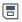

# Aggregating Stock Transactions Instructions

These instructions assume you have SAS Event Stream Processing 6.2 installed.

## Download Files

Download the `orders.xml` and `orders.csv` files from the files folder on this site to your local computer.

## View and Edit the Model

You can view and edit your local copy of the orders.xml model in one of two ways:

- Upload the `orders.xml` file to SAS ESP Studio
- Open the `orders.xml` file with a text editor

### Viewing and Editing the Model Using SAS ESP Studio

> NOTE: Ensure the SAS ESP Server is running.

Use the following steps to view and edit the `orders.xml` model in SAS ESP Studio. You can skip this section and refer to the [Viewing and Editing the Model with a Text Editor](#viewing-and-editing-the-model-with-a-text-editor) section for instructions on editing the `orders.xml` model in a text editor.

#### Upload Project

1.	In the upper-right corner of SAS ESP Studio, click   to reveal the **More actions** menu and select **Upload projects**.

2.  Click .

3.	Navigate to the file that contains the project that you want to upload and click **Open**.

4.	Click **Upload**. The file is uploaded, and the **Upload Projects** window displays the file, project name, and a green checkmark if the upload was successful.

5.	Click **Close** to close the Upload Projects window.

#### Edit Input Data Connector

1.	Double-click the project named `orders_proj` to open it.

2.	Click the **Orders** window to select it and expand the **Input Data (Publisher) Connectors**.

3.	Click the publisher connector and click   to edit the property.
    The Connector Configuration window appears.

    

4.  Edit the **fsname** field to include the full path to your copy of the `orders.csv` file.

5.	Click **OK**.

#### Add Fields to Output

1.	Click the **TotalVolume** window to select it.

2.	Click   to display the output schema and click   to edit the **Output Schema** window.

3.	Click   to create a new field.

    

4.	Populate the parameters for the new field as follows:

    - Under **Field Name**, type **averagePrice**.
    - Under **Type**, select **double**.
    - Under **Aggregate Function**, select **ESP_aAve**.
    - Under **Parameters**, select **price**.
    

5.	Click **OK** to add the new field to the schema.

#### Test Model

1.	Click   to save your changes. A project must be saved before it can be tested.

2.	Click   to open the Test window.

3.	Click   to begin the test.

4.	The **Orders** window is displayed initially. Click the **TotalVolume** tab to display the output.

    

#### Download Project

1.	Close the **Test** window and then close the project.

2.	Ensure **orders_proj** is selected, click   to display the **More Actions** menu, and click **Download project**. A file named `orders_proj.xml` is downloaded to your local Downloads folder.

### Viewing and Editing the Model with a Text Editor

Use the following steps to view and edit the `orders.xml` model in a text editor. If you edited the model using SAS ESP Studio you can skip this section. Refer to the section, [Viewing and Editing the Model Using SAS ESP Studio](#viewing-and-editing-the-model-using-sas-esp-studio), for instructions on editing the `orders.xml` model using SAS ESP Studio.

1.	Locate the `connector` element and go to the `property` element with the attribute `fsname` on line number 49, approximately. The appropriate line is highlighted below:

    

2.	Edit the `fsname` attribute of to include the full path to your copy of `orders.csv`. Example:

    ~~~xml
    <property name='fsname'>/home/sasdemo/orders/orders.csv</property>
    ~~~

3.	Optional. Add a `rate` property to the connector to slow the events per second rate to 1000. Example:

    ~~~xml
    <property name='rate'>1000</property>
    ~~~

4.	Optional. Go to the `window-aggregate` element, add additional fields to the `schema` element, and add the appropriate `field-expr` elements for the new fields. Example:

    

5.	Save your changes.

6.	Upload the `orders.xml` file from your local computer to the server directory you are using.

## Start the Model on the XML Server

Use the following command line syntax to start the orders.xml model on the XML server:

~~~bash
$DFESP_HOME/bin/dfesp_xml_server -model file:///yourpath/orders.xml -pubsub 55555
~~~

## Subscribe to the Output

You can subscribe to the TotalVolume window output in one of two ways:

- Using a file/socket adapter
- Using SAS ESP Streamviewer

### Subscribing to the Output with a File/Socket Adapter

Use the following steps to subscribe to the **TotalVolume** window using a file/socket adapter and write the results to csv file `totalvolume.out`. You can also use SAS ESP Streamviewer to subscribe to the output from the **TotalVolume** window. Refer to the section, [Subscribing to the Output with SAS ESP Streamviewer](#subscribing-to-the-output-with-sas-esp-streamviewer), for instructions.

1.	Type the following command syntax:

    ~~~bash
    $DFESP_HOME/bin/dfesp_fs_adapter -C type=sub,url=”dfESP://localhost:55555/orders_proj/orders_cq/TotalVolume?snapshot=true”,fstype=csv,fsname=/yourpath/totalvolume.out
    ~~~

2.	In a new window, use the `tail -f` command to view the `totalvolume.out` csv file as it is being updated. Example:

    ~~~bash
    tail -f /home/sasdemo/esp_examples/orders/totalvolume.csv
    ~~~

### Subscribing to the Output with SAS ESP Streamviewer

Use the following steps to subscribe to the **TotalVolume** window using SAS ESP Streamviewer. You can also use a file/socket adapter to subscribe to the output from the **TotalVolume** window. Refer to the section, [Subscribing to the Output with a File/Socket Adapter](#subscribing-to-the-output-with-a-file-socket-adapter), for instructions.

1.	Start ESP Streamviewer using the following URL:

    ~~~
    https://Streamviewer-host-name/SASEventStreamProcessingStreamviewer
    ~~~
    
2.	Start the `orders.xml` model on the XML Server. Refer to the section, [Start the Model on the XML Server](#start-the-model-on-the-xml-server) for syntax.

3.	On the ESP Streamviewer dashboard, click   to open the ESP Model Viewer.

    

4.	Click the **TotalVolume** window to select it, and then click    to add an updating subscriber to the dashboard. Click **Close** to close the ESP Model Viewer.

    